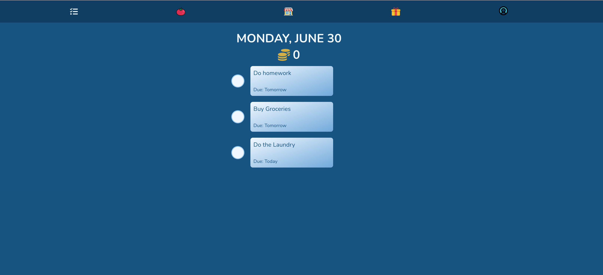

# ✅ Task Master

**Task Master** is a full-stack productivity and gamification app built for portfolio purposes. It allows users to manage their tasks with a fully-featured to-do system — but with a twist: it rewards focus and task completion using a Pomodoro-based gamification system. Users can earn coins by staying productive and redeem them for custom rewards. This project showcases my ability to design and build a complete PERN (PostgreSQL, Express, React, Node.js) application with real-world features like authentication, OAuth, CRUD, and time-based mechanics.

---

## 🚀 Live Demo

[🔗 View Live Project](https://task-master-rocklyn.onrender.com/)



---

## 🎯 Project Goals

- Demonstrate full-stack development with a gamified approach
- Encourage productivity through habit-forming UX
- Implement task tracking, focus sessions, and rewards
- Showcase user authentication with both local and Google login

---

## ✨ Features

- User authentication using Passport.js (local & Google OAuth)
- Full CRUD functionality for tasks and custom rewards
- Pomodoro focus timer with coin rewards per session
- Earn coins by completing tasks; miss deadlines and lose coins
- Create custom rewards and "purchase" them with earned coins
- Responsive design for mobile and desktop

---

## 🧰 Tech Stack

**Frontend:** React, TypeScript, CSS, Redux  
**Backend:** Node.js, Express  
**Database:** PostgreSQL  
**Authentication:** Passport.js (Local Strategy + Google OAuth)

---

## 🛠 Installation & Setup

### Prerequisites
- Node.js
- Git

⚠️ This app connects to a private PostgreSQL database hosted on Render. For security reasons, the database credentials are not public.

If you'd like to run this project locally for learning or collaboration, please contact me directly.

---

### 🔧 Setup Instructions

```bash
# 1. Clone the repository
git clone https://github.com/yourusername/task-master.git
cd task-master

# 2. Install backend dependencies
npm install

# 3. Install frontend dependencies
cd view
npm install
```


--- 

## 👤 Author

**Your Name**  
[GitHub](https://github.com/rocklyn-r) • [LinkedIn](https://linkedin.com/in/antica-rocklyn-rusinovic)


## 📄 License

This project is for personal portfolio use and not licensed for commercial deployment.